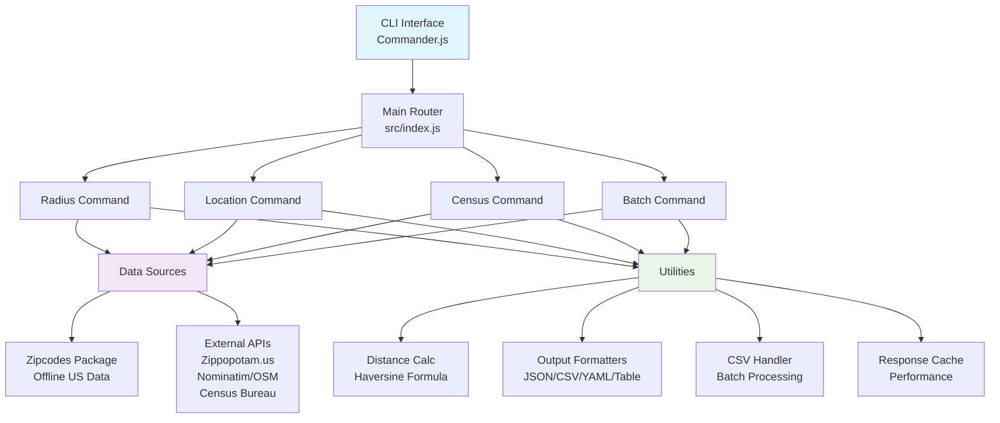
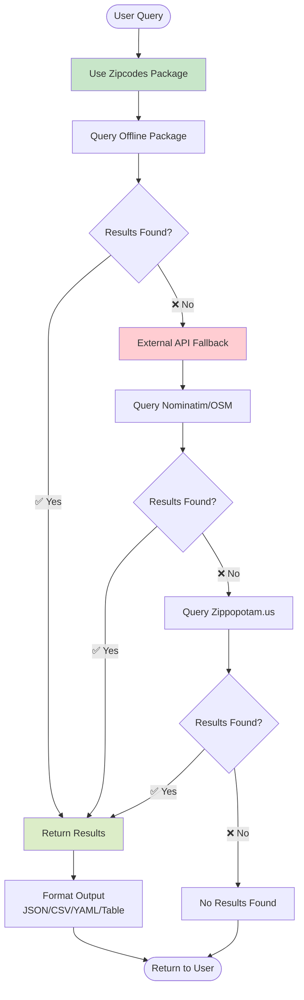
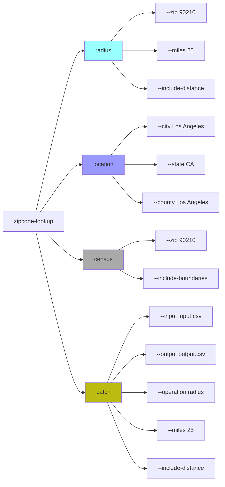
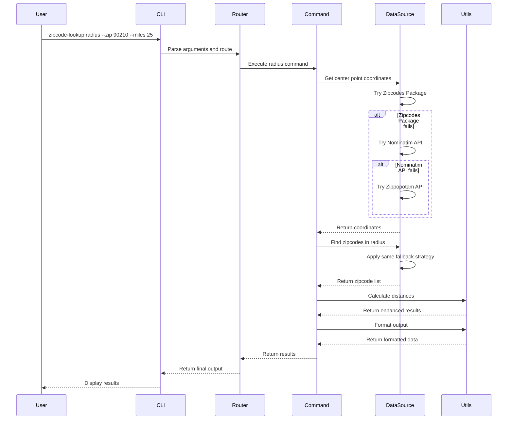

# Diagrams

## 🏗️ Architecture Overview

```mermaid
graph TB
    CLI[CLI Interface<br/>Commander.js] --> Router[Main Router<br/>src/index.js]

    Router --> RC[Radius Command]
    Router --> LC[Location Command]
    Router --> CC[Census Command]
    Router --> BC[Batch Command]

    RC --> DS[Data Sources]
    LC --> DS
    CC --> DS
    BC --> DS

    DS --> ZP[Zipcodes Package<br/>Offline US Data]
    DS --> API[External APIs<br/>Zippopotam.us<br/>Nominatim/OSM<br/>Census Bureau]

    RC --> UTILS[Utilities]
    LC --> UTILS
    CC --> UTILS
    BC --> UTILS

    UTILS --> DIST[Distance Calc<br/>Haversine Formula]
    UTILS --> FMT[Output Formatters<br/>JSON/CSV/YAML/Table]
    UTILS --> CSV[CSV Handler<br/>Batch Processing]
    UTILS --> CACHE[Response Cache<br/>Performance]

    style CLI fill:#e1f5fe
    style DS fill:#f3e5f5
    style UTILS fill:#e8f5e8
```

## 🔄 Data Source Fallback Strategy

```mermaid
flowchart TD
    START([User Query]) --> ZIPCODE[Use Zipcodes Package]

    ZIPCODE --> ZQUERY[Query Offline Package]
    ZQUERY --> ZRESULT{Results Found?}
    ZRESULT -->|✅ Yes| SUCCESS[Return Results]
    ZRESULT -->|❌ No| API[External API Fallback]

    API --> NOMINATIM[Query Nominatim/OSM]
    NOMINATIM --> NRESULT{Results Found?}
    NRESULT -->|✅ Yes| SUCCESS
    NRESULT -->|❌ No| AQUERY[Query Zippopotam.us]
    AQUERY --> ARESULT{Results Found?}
    ARESULT -->|✅ Yes| SUCCESS
    ARESULT -->|❌ No| ERROR[No Results Found]

    SUCCESS --> FORMAT[Format Output<br/>JSON/CSV/YAML/Table]
    FORMAT --> OUTPUT([Return to User])

    ERROR --> OUTPUT

    style ZIPCODE fill:#c8e6c9
    style API fill:#ffcdd2
    style SUCCESS fill:#dcedc8
```

## Command Structure

```mermaid
graph LR
    CLI[zipcode-lookup] --> R[radius]
    CLI --> L[location]
    CLI --> C[census]
    CLI --> B[batch]

    R --> R1[--zip 90210]
    R --> R2[--miles 25]
    R --> R3[--include-distance]

    L --> L1[--city Los Angeles]
    L --> L2[--state CA]
    L --> L3[--county Los Angeles]

    C --> C1[--zip 90210]
    C --> C2[--include-boundaries]

    B --> B1[--input input.csv]
    B --> B2[--output output.csv]
    B --> B3[--operation radius]
    B --> B4[--miles 25]
    B --> B6[--include-distance]

    style R fill:#9ff
    style L fill:#99f
    style C fill:#aaa
    style B fill:#bb1
```

### Data Flow Architecture

```mermaid
sequenceDiagram
    participant User
    participant CLI
    participant Router
    participant Command
    participant DataSource
    participant Utils

    User->>CLI: zipcode-lookup radius --zip 90210 --miles 25
    CLI->>Router: Parse arguments and route
    Router->>Command: Execute radius command

    Command->>DataSource: Get center point coordinates
    DataSource->>DataSource: Try Zipcodes Package
    alt Zipcodes Package fails
        DataSource->>DataSource: Try Nominatim API
        alt Nominatim API fails
            DataSource->>DataSource: Try Zippopotam API
        end
    end
    DataSource-->>Command: Return coordinates

    Command->>DataSource: Find zipcodes in radius
    DataSource->>DataSource: Apply same fallback strategy
    DataSource-->>Command: Return zipcode list

    Command->>Utils: Calculate distances
    Utils-->>Command: Return enhanced results

    Command->>Utils: Format output
    Utils-->>Command: Return formatted data

    Command-->>Router: Return results
    Router-->>CLI: Return final output
    CLI-->>User: Display results
```
